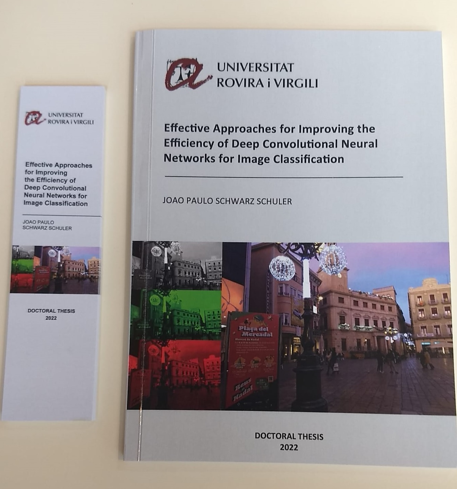

# Dr. JP - GitHub Repositories

More about my work can be found at:
- [JP @ ResearchGate.](https://www.researchgate.net/profile/Joao-Paulo-Schwarz-Schuler)
- [JP @ SOURCEFORGE.](https://sourceforge.net/u/jpss/profile/)
- [JP @ Papers with Code.](https://paperswithcode.com/search?q=author%3AJoao+Paulo+Schwarz+Schuler)
- [JP @ YouTube.](https://www.youtube.com/channel/UC2a1cvovfmO1agAvYp6v54w)
- [JP @ kaggle.](https://www.kaggle.com/joaopauloschuler/datasets)
- [JP @ Home.](http://www.schulers.com/jpss/)

## Scientific Publications
Optimizing the first layers of a convolutional neural network:
- [Color-aware two-branch DCNN for efficient plant disease classification](https://www.researchgate.net/publication/361511874_Color-Aware_Two-Branch_DCNN_for_Efficient_Plant_Disease_Classification).
- [Reliable Deep Learning Plant Leaf Disease Classification Based on Light-Chroma Separated Branches.](https://www.researchgate.net/publication/355215213_Reliable_Deep_Learning_Plant_Leaf_Disease_Classification_Based_on_Light-Chroma_Separated_Branches)

Optimizing deep layers of a convolutional neural network:
- [Grouped Pointwise Convolutions Reduce Parameters in Convolutional Neural Networks.](https://www.researchgate.net/publication/360226228_Grouped_Pointwise_Convolutions_Reduce_Parameters_in_Convolutional_Neural_Networks)
- [An Enhanced Scheme for Reducing the Complexity of Pointwise Convolutions in CNNs for Image Classification Based on Interleaved Grouped Filters without Divisibility Constraints.](https://www.researchgate.net/publication/363413038_An_Enhanced_Scheme_for_Reducing_the_Complexity_of_Pointwise_Convolutions_in_CNNs_for_Image_Classification_Based_on_Interleaved_Grouped_Filters_without_Divisibility_Constraints)

Publica&ccedil;&otilde;es em Portugu&ecirc;s:
- [A Evolu&#231;&#227;o dos Algoritmos Mentais.](https://www.researchgate.net/publication/357204541_A_Evolucao_dos_Algoritmos_Mentais)
- [Da F&#237;sica &#224; Intelig&#234;ncia Extrassom&#225;tica.](https://www.researchgate.net/publication/365687206_DA_FISICA_A_INTELIGENCIA_EXTRASSOMATICA)
- [Intelig&#234;ncia Artificial Popperiana.](https://www.researchgate.net/publication/357164807_Inteligencia_Artificial_Popperiana)
- [Opera&#231;&#245;es L&#243;gicas Qu&#226;nticas e Colorabilidade de Grafos.](https://www.researchgate.net/publication/357205247_Operacoes_Logicas_Quanticas_e_Colorabilidade_de_Grafos)
- [Verdinhos e Felizes?](https://www.amazon.com.br/dp/B0BSCKBSDX)

## Doctoral Thesis
JP's doctoral thesis can be read [here](https://www.researchgate.net/publication/365687628_Effective_Approaches_for_Improving_the_Efficiency_of_Deep_Convolutional_Neural_Networks_for_Image_Classification "Effective Approaches for Improving the Efficiency of Deep Convolutional Neural Networks for Image Classification").

